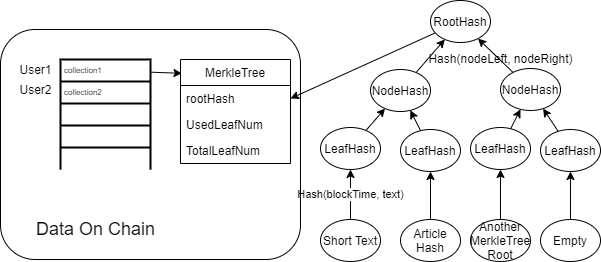
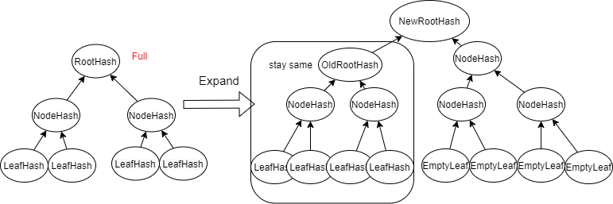

# Composition Copyright

This is a Smart Contract used to store hashed papers for its author. It apply an dynamic merkle tree to store composition hash to the leaf. The article itself should be stored offchain but the contract will provide a verify function to check the article hash and the stored date for each author. The purpose of this contract is to prove that the author had the content at specific date.

## Structure

## Instuction
### post composition
1. Call initMyCollection from the contract to initialize a merkle tree with 4 empty leaves.
2. Use the offchain script to update the first empty leaves with whatever data(bytes 32 string). It can be short plain text, artile hash, ipfs address or event another merkle tree root.
3. Use the witnesses generated from previous step and the content you want to update to call the updateLeaf fuction from the contract. The contract will first verify the witnesses and then use them with the new content to recalculate the root hash and update it. If the leaves were full, call expandTree.
4. The event listener offchain should update the leaves content and the date in a traditional database.

### verify composition
1. Get the leaf node and store date from database(off-chain);
2. Use the offchain script to generate the path and witnesses.
3. Call verify function from the contract with the data generated. 

## Benefits
1. Only one hash data should be stored for each user. So it is only good if updating is cheaper than adding new one.
2. Stored data hashed with block date cannot be mutated.
3. The three can be dynamically extented to store infinite number of collections.

## Drawback
1. More computation on chain.
2. Have to update one by one.
3. The data should also be stored offchain.

## My Extra Thoughts
1. Sometime we only want to prove a specific paragraph of a paper, so we can store another entire merkle tree as the content of leaf. I can add another function to the contract to support the verify of "sub-merkletree".
2. If there is no need to verify the date, we can add a batch update function. The contract can fist verify a subtree is all empty and then recaulculate the root directly from the node. Besides, the leaves are updated in order, so we can have two types of ndoes, the one allowing batch update and without date and the one with date but having to update individually. We jsut need to update another date node after the no-date nodes, which can guantee the no-date nodes were updated before the date.

